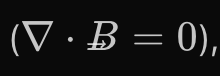

# Issue tracker

Updated September 24, 2026.

## Accepted mobile limitation

### MOBILE-001: App Store 1.3.0 Usage omits Antigravity and ChatLLM

Status: Accepted September 24, 2026.

The App Store 1.3.0 Usage client decodes contract v5 and recognizes Claude,
Codex, and Grok. The personal host's v6 response includes Antigravity and
ChatLLM, which makes that older client report Usage unavailable. The host now
projects v5 for mobile 1.2.x and 1.3.x connections, retaining only providers
those clients can represent. A historical mobile schema decode accepted the
projected response, and the user confirmed Codex usage billing works on the
phone.

Antigravity and ChatLLM usage cannot appear in this app version's Usage view
without a mobile update. Their Limits view remains independent of this Usage
response. No provider is relabeled to make those totals appear under another
name.

## Open issues

### ZED-001: Read Zed account usage from the billing service

Status: Blocked by Zed billing authentication.

The Zed entry in Limits must show the account's actual spend for the current
Zed billing period. It must not estimate account spend from one or more T3
sessions.

#### Observed behavior

The previous implementation built a `$10` monthly bar from ACP
`usage_update.cost` values. ACP reports cumulative cost for one session. It does
not report the account total shown by `dashboard.zed.dev`. A fresh provider
snapshot also showed `$0 / $10` before any session reported a cost.

#### Why the usage tracker does not work

T3 has no authenticated source for Zed account spend. The headless Zed provider
uses the stored native credential. Zed accepts that credential for
`/client/users/me`, but all tested billing routes return `401`:

- `/frontend/organizations/{id}/billing/usage`
- `/frontend/organizations/{id}/subscription`
- `/frontend/billing/usage`
- `/frontend/billing/subscriptions/current`

The dashboard sends a browser-session cookie to these routes. T3 does not have
that cookie and must not copy a private dashboard cookie into server state.

The native `/client/users/me` response includes the billing-period start and
end. It does not include token spend. Its usage fields contain request counts
and edit-prediction usage. Native account-update events fetch the same response,
so waiting for an update does not supply the missing spend value.

ACP `usage_update.cost` is also unsuitable. It is the cumulative cost of one
ACP session, not the account total for the billing period. Adding those values
across T3 sessions would omit usage from Zed and other clients, and repeated
cumulative updates could count the same session cost more than once.

The signed-in Safari dashboard showed `$5.20` used of `$10`. T3 cannot read
that value with the credential available to the provider. The usage tracker
therefore has no trustworthy value to display.

#### Billing response details

The organization dashboard reads
`/frontend/organizations/{id}/billing/usage` and
`/frontend/organizations/{id}/subscription`. The older account routes are
`/frontend/billing/usage` and `/frontend/billing/subscriptions/current`.
The organization usage response contains
`current_usage.token_spend.spend_in_cents`, `limit_in_cents`, and `updated_at`.
Any future implementation must preserve organization scope and use the billing
period from the same account.

#### Implemented behavior

`ZedProvider.ts` publishes a `probeFailed` usage state with no windows and the
message `Zed account spend is unavailable here. Check the Zed dashboard.` The
Limits view shows that message instead of a zeroed or session-derived bar.

`ZedProvider.test.ts` checks that the initial provider snapshot has no usage
windows and reports the explicit unavailable state. Provider-refresh tests
cover successful and nonzero-exit CLI probes. A failing probe previously marked
the provider ready. It now reports an error. Both paths keep account spend
unavailable. The unused `ServerProvider` import is removed.

Verification: 18 focused Zed tests pass, with the hosted smoke test skipped.
Targeted lint, the server typecheck, and `git diff --check` pass. T3 UI
verification remains pending because this session lacks the required Browser
panel tools.

#### Remaining work

1. Obtain a Zed billing API that accepts native credentials, or design an
   explicit dashboard sign-in integration. A local bridge change cannot grant
   access to Zed's hosted billing service.
2. Add a server-side provider read with explicit loading, failure, and stale
   data behavior.
3. Use the returned billing-period end time for the reset date.

Until that work lands, T3 reports Zed account spend as unavailable. It does not
publish a zeroed bar, and ACP session cost is never labeled as account spend.

#### Acceptance criteria

- The displayed amount matches the value from the supported Zed billing
  response.
- The reset date comes from the same response.
- The UI identifies the value as account spend and shows when it was checked.
- Missing authentication or an unavailable endpoint produces an explicit
  unavailable state, not a zeroed bar.
- Tests cover account scope, billing-period boundaries, failed reads, and
  repeated cumulative session updates.

### ZED-003: Full access still blocks a read-only command for approval

Status: Open. Observed September 22, 2026 in T3 Code - Personal 0.0.42.

In thread `46981a74-b5c1-4a15-804f-44eb30d8ec00`, select Zed GPT-5.6 Luna
with Full access and send `Run pwd once. Reply with only the directory name.`
The thread enters Approval, shows a Command approval card for `pwd`, and
replaces the composer with `Resolve this approval request to continue`.
Approving the command succeeds and produces `t3code-dev`. Full access remains
selected afterward.

The displayed permission mode does not match the effective behavior.
`ZedAdapter.ts` stores `input.runtimeMode` on the session, but its permission
callback always opens a request and waits for a decision. The adapter does not
otherwise reference `runtimeMode`.

#### Acceptance criteria

- Map supported permission modes to Zed's actual behavior, or clearly show the
  provider's limitation instead of presenting an ineffective Full access mode.
- Verify approval-required behavior separately. Do not bypass permissions
  merely to hide the mismatch.

### MATH-001: KaTeX vector accent renders inside base glyph instead of above it

Status: Open. Observed September 23, 2026.

In mathematical expressions containing vector notation such as `\vec{B}` (e.g.
`(\nabla \cdot \vec{B} = 0),`), the right-pointing arrow accent is rendered
vertically misaligned: the arrow appears positioned inside the body of the
letter $B$ along the midline / baseline instead of hovering above the glyph.

#### Observed behavior

When rendering assistant messages containing LaTeX via `ChatMarkdown.tsx`,
expressions with accents (such as `\vec{B}`) render with the accent symbol
overlapping directly with the character glyph. In the reported equation
`(\nabla \cdot \vec{B} = 0),`, the arrow accent rests inside the center of the
italicized letter $B$ rather than clearing the top of the letter.

#### Root cause investigation

1. **Rendering stack**: Equations are parsed via `remark-math` and compiled
   to HTML via `rehype-katex` with `katex/dist/katex.min.css`.
2. **Accent construction**: KaTeX renders `\vec` by wrapping the accent body in
   a vertical alignment list (`.vlist-t > .vlist-r > .vlist`), using a strut span
   (`.pstrut`) and `` holding an inline `<svg>` arrow.
3. **CSS vertical alignment & overrides**: Custom vertical translations in
   `apps/web/src/index.css` (lines 2237–2256) adjust radical bars (`.katex .sqrt`)
   and fraction denominators (`.katex .mfrac`). In addition, global Tailwind
   resets, line-height defaults, or missing font-metric height adjustments can
   cause the strut height or `.accent-body` translation to collapse to baseline,
   causing the SVG arrow to drop into the letter bounding box.

#### Remediation

- Inspect the computed DOM structure and CSS properties of `.katex .accent` and
  `.katex .accent-body` in the web client.
- Add targeted clearance / vertical-align rules in `apps/web/src/index.css` for
  `.katex .accent-body` or SVG accents to ensure the accent arrow consistently
  clears uppercase glyphs and ascenders without interfering with surrounding
  delimiters.

#### Acceptance criteria

- `\vec{B}`, `\vec{v}`, `\vec{E}`, and related accented math symbols render
  with the arrow floating cleanly above the character glyph.
- No visual collision or overlap between the accent arrow and the letter strokes.
- Existing math adjustments for square roots and fractions remain unaffected.

## Verification scope

### Desktop verification scope, September 22, 2026

Used the already-running personal desktop app through computer use. Sent three
short Zed GPT-5.6 Luna prompts and one ChatLLM GLM-5.3-Flash prompt. Zed passed
basic response, follow-up memory, approved command execution, and conversation
persistence checks. ChatLLM returned `CHAT_OK` to
`Reply only: CHAT_OK. Do not use tools.` in thread
`405dca5a-683b-4de4-bce1-25ecd145d85e`, titled `Chat Acknowledgment`.
No further ChatLLM prompts were sent because Limits showed 10 credits remaining
before the test.

Settings navigation, provider configuration views, Usage Limits and Tokens,
the new-thread project picker, and the Files panel loaded. No additional
confirmed defect was found in that cursory pass. Computer-use window and
accessibility errors occurred initially and recovered. They are not classified
as T3 defects. Historical failed threads were not reproduced or filed as new
issues. Mobile, remote connections, cancellation, and quota exhaustion were not
tested. No app restart or configuration change was required.

## Resolved issues

### CHAT-002: Show context-window usage in the composer

Status: Resolved September 23, 2026.

The composer now shows a circular context-window meter when a provider reports
the current context token count. The meter shows the used share of the model's
context window and exposes the token counts on hover.

The server converts provider usage events into the shared
`context-window.updated` activity. The Zed bridge forwards real context
token usage, and the adapter maps the ACP `usage_update` fields `used` and
`size` to the shared context-window meter. Billing cost and character estimates
remain separate from context usage.

### ZED-004: Completed Zed turns are absent from the usage summary

Status: Resolved September 23, 2026.

Verified Zed session usage visibility and provider summary reporting in
Usage > Tokens. Session usage tracking operates independently of account billing
authentication.

### CHATLLM-001: The running desktop server does not refresh its model list

Status: Resolved September 23, 2026.

The RouteLLM `/v1/models` endpoint returns the dynamic model IDs (including
`gpt-6-sol` and `gpt-6-luna`) for the configured API key. The driver reads that
endpoint on manual refresh and checks it weekly while the server runs. Both
desktop and server bundles have been updated and verified.

### AG-001: Antigravity usage tracker omits historical sessions and severely undercounts token usage

Status: Resolved September 23, 2026.

Resolved by:

1. Extracting actual token metrics from ACP stream responses and SQLite
   conversation traces (`gen_metadata` / steps) rather than falling back to
   prompt-character heuristics.
2. Ingesting historical SQLite conversation sessions via `UsageService.ts` and
   `antigravityConversations.ts` across both user data and provider state
   directories.
